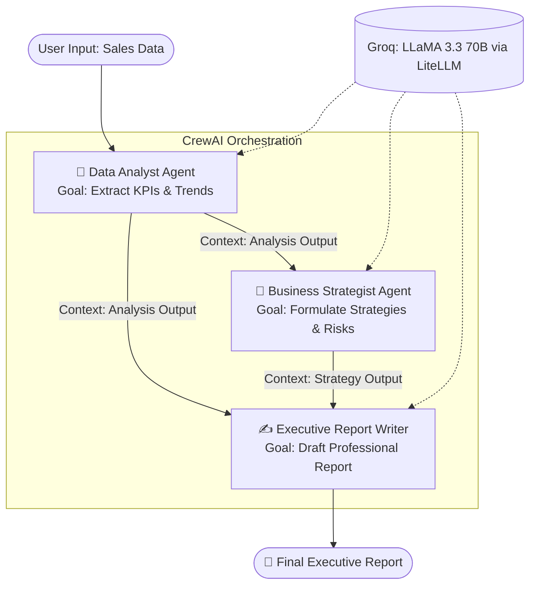
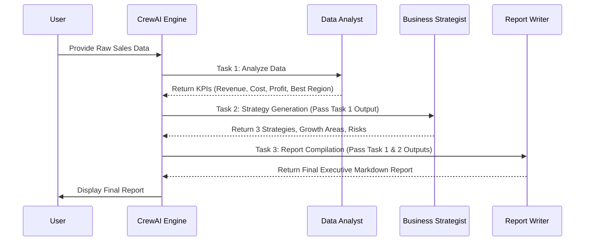

 # 🚀 Automated Business Intelligence (BI) Report Generator using CrewAI


Welcome to the **Automated Business Intelligence (BI) Report Generator** repository! This project implements an advanced **Multi-Agent Artificial Intelligence System** designed to automate the complete Business Intelligence pipeline. By orchestrating specialized AI agents using CrewAI and powering their reasoning with Groq's high-speed LLaMA 3.3 70B model, this system ingests raw sales data and transforms it into a polished, executive-ready professional report in a matter of seconds.

---

## 📖 Study & Project Overview

In the modern corporate ecosystem, data is abundant, but actionable insights are scarce. The traditional Business Intelligence (BI) lifecycle involves tedious data extraction, manual analytical computations, strategy formulation, and finally, the arduous task of drafting reports. This project is a deep-dive study into **Agentic AI**—specifically, how autonomous AI agents can be assigned distinct corporate roles (Data Analyst, Business Strategist, and Executive Report Writer) and chained together to collaborate on a complex, multi-step problem. 

By leveraging **CrewAI**, we move beyond simple LLM text generation. We create a simulated corporate workforce where agents share context, pass outputs sequentially, and build upon each other's work to achieve a unified goal. This study proves that LLM orchestration can significantly reduce the cognitive load on human workers, transforming hours of labor into mere seconds of compute time.

---

## 🎯 Working Intention

### The Problem Statement
In fast-paced companies, managers and decision-makers face several critical hurdles:
1. **Manual Data Analysis:** Analyzing large sets of sales data manually is highly susceptible to human error and bias.
2. **Time-Consuming Preparation:** Drafting comprehensive business reports takes hours, pulling focus away from execution.
3. **Delayed Insights:** By the time raw data is converted into a strategic report, the market window for capitalizing on those insights may have already closed.

### The Solution
Our intention with this project is to eliminate the bottleneck between data collection and strategic execution. We built an automated pipeline that:
1. **Analyzes Business Data:** Instantly calculates totals, profits, and identifies the best-performing sectors.
2. **Extracts Strategic Insights:** Translates raw numbers into actionable growth opportunities and flags potential market risks.
3. **Generates Executive Reports:** Compiles all findings into a structured, professional format ready for board-level review.

---

## 🏗️ Architecture Diagram

The system architecture relies on a specialized agent hierarchy. Below is the architectural representation of our CrewAI setup.



---

## 🔄 Workflow Diagram

The operational workflow follows a strict sequential process managed by the CrewAI framework. 



---

## ⚙️ State Flow & Task Execution

The execution of tasks (State Flow) in this project is strictly **Sequential**. Here is exactly how the state progresses:

1. **Initialization State:** 
   - The environment is set up, API keys are validated, and the user provides the raw sales data string.
2. **Analysis State (Task 1):** 
   - The `data_analyst` agent receives the data. It computes the total revenue, total cost, total profit, and identifies the best-performing region. The state is updated with a detailed mathematical breakdown.
3. **Strategic State (Task 2):** 
   - The `business_strategist` agent is invoked. It reads the state left by the Data Analyst. It is specifically instructed not to re-analyze the math, but to interpret it. It generates 3 distinct business strategies, highlights growth paths, and warns of financial/market risks.
4. **Reporting State (Task 3):** 
   - The `report_generator` agent takes the outputs from both the Analysis State and the Strategic State. It synthesizes this into an Executive Summary, Key Insights, Recommendations, and Conclusion.
5. **Termination State:** 
   - The final consolidated string is output to the console for the user.

---

## 🧰 Tech Stack Requirements & Infographic

This project relies on a modern, lightweight, and incredibly fast AI tech stack.

| Component | Technology Used | Purpose |
| :--- | :--- | :--- |
| **Language** | Python 3.12+ | Core programming language for logic and execution. |
| **Orchestration** | CrewAI (v1.11.0) | Framework to create agents, define tasks, and manage their sequential execution. |
| **LLM Backend** | Groq API | Provides access to ultra-fast inference hardware. |
| **AI Model** | LLaMA 3.3 70B Versatile | The foundational large language model performing the reasoning. |
| **Integration** | LiteLLM | Acts as a bridge between CrewAI and the Groq API. |
| **Environment** | Google Colab / Jupyter | Interactive notebook environment for running and testing the code. |

### Tech Stack Infographic (ASCII Representation)
```text
  [ PYTHON 3.12 ] ---> The Foundation
         |
         v
  [ CREWAI CORE ] ---> Orchestrates Agents (Analyst, Strategist, Writer)
         |
         +--> [ LiteLLM Bridge ] 
                     |
                     v
             [ GROQ LPU CLOUD ] ---> Ultra-fast inference
                     |
                     v
          [ LLaMA 3.3 70B MODEL ] ---> The Brains of the Operation
```

---

## 📂 Folder Structure

If you are setting this up as a complete repository on your local machine, your directory should look like this:

```text
Automated-BI-Report-Generator/
│
├── README.md                                     # Comprehensive project documentation
├── requirements.txt                              # Python dependencies
├── .env.example                                  # Template for environment variables (API keys)
├── data/
│   └── sample_sales_data.txt                     # Example input data formats
│
├── Day_22_Crew_Ai_Orchestration.ipynb            # Main Jupyter Notebook with core logic
│
└── output/
    └── sample_executive_report.md                # Generated reports saved here
```

---

## 🚀 Setup & Execution

### Prerequisites
- Python 3.12 or higher installed on your system (or a Google Colab account).
- A free API key from [Groq Console](https://console.groq.com).

### Installation Instructions

1. **Clone the Repository:**
   ```bash
   git clone https://github.com/yourusername/Automated-BI-Report-Generator.git
   cd Automated-BI-Report-Generator
   ```

2. **Install Dependencies:**
   ```bash
   pip install crewai litellm python-dotenv
   ```

3. **Configure Environment Variables:**
   - Create a `.env` file in the root directory.
   - Add your Groq API key:
     ```env
     GROQ_API_KEY=gsk_your_api_key_here
     ```

4. **Run the Project:**
   - Open the `Day_22_Crew_Ai_Orchestration.ipynb` notebook in Jupyter or Google Colab.
   - Run all cells. 
   - When prompted, input your sales data, or press `Enter` to use the default sample data.

---

## 🔮 Future Scope

While the current system is highly capable, there are numerous avenues for future expansion:

1. **Data Ingestion Capabilities:** 
   - Upgrade the input mechanism to directly read from `.csv`, `.xlsx`, or connect directly to SQL databases (e.g., PostgreSQL, MySQL) rather than relying on formatted text strings.
2. **Human-in-the-Loop (HITL):** 
   - Implement a pause state where a human manager can review and approve the Data Analyst's mathematical outputs before the Strategist begins its work.
3. **Data Visualization Agent:** 
   - Introduce a 4th agent capable of writing Python `matplotlib` or `plotly` code to generate visual charts (bar graphs, pie charts) and save them to the output folder.
4. **Export Modules:** 
   - Automatically convert the final markdown report into a branded PDF or Word (`.docx`) document.
5. **Multi-Language Support:** 
   - Utilize the LLM's translation capabilities to instantly output the final executive report in multiple languages for global stakeholders.
6. **Structured Logging:**
   - Integrate comprehensive error handling and logging to track agent thought processes and API token usage for cost analysis.

---
*Developed as a showcase of Multi-Agent Orchestration using CrewAI and Groq.*
